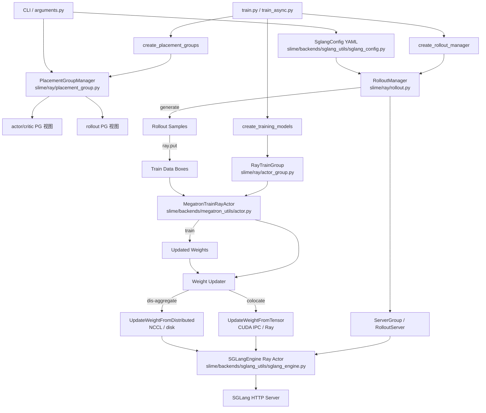

# slime 资源调度与部署策略架构模型

## 1. 范围与目标

理解 slime 如何在 Ray 集群上为训练（Megatron）与推理（SGLang）分配 GPU/CPU 资源，并重点建模两种部署策略：

- **co-locate（共置）**：训练 actor 与 rollout engine 共享同一 Placement Group 与物理 GPU，通过 offload/onload 时间片复用。
- **dis-aggregate（解耦）**：训练 actor 与 rollout engine 占用 disjoint GPU；可进一步通过 prefill-decode（PD）/ encoder-prefill-decode（EPD）分组实现推理内部解耦。

## 2. 组件图

## 3. 调用链涉及的主要类与方法

| 组件文件 | 类 / 顶层函数 | 关键方法 | 职责 |
|---|---|---|---|
| `train.py` / `train_async.py` | `train(args)` | — | 训练入口，按序创建 Placement Group、RolloutManager、训练 actor，并执行主循环。 |
| `slime/ray/placement_group.py` | `_create_placement_group(num_gpus)` | — | 创建 Ray Placement Group，每个 GPU 一个 bundle，PACK 策略；探测并排序物理 GPU ID。 |
| | `_get_placement_group_layout(args)` | — | 根据 `colocate` / `rollout_external` / `debug_*` 计算 PG 总大小与 rollout 起始偏移。 |
| | `create_placement_groups(args)` | — | 返回 `{actor, critic, rollout}` 三个 PG 视图（critic 复用 actor）。 |
| | `allocate_train_group(...)` | — | 封装创建 `RayTrainGroup`，默认每个 actor 请求 `0.4` GPU。 |
| | `create_training_models(...)` | — | 创建 actor/critic `RayTrainGroup`，调用 `async_init`，注入 `rollout_manager`。 |
| | `create_rollout_manager(args, pg)` | — | 创建 `RolloutManager` actor，并在需要时立即 offload rollout。 |
| `slime/ray/actor_group.py` | `RayTrainGroup` | `__init__`、`_allocate_gpus_for_actor`、`async_init`、`async_train`、`update_weights`、`onload`、`offload` | 在 PG 上创建并管理一组 Megatron 训练 Ray actor。 |
| `slime/ray/rollout.py` | `ServerGroup` | `start_engines`、`offload`、`onload`、`onload_weights_from_disk` | 同构 SGLang engine 的分组；负责创建 engine actor 并触发内存释放/恢复。 |
| | `RolloutServer` | `recover`、`offload`、`onload`、`onload_weights`、`onload_kv` | 一个模型在一个 router 后的 engine 集合，可包含多个 `ServerGroup`（如 PD 的 prefill/decode）。 |
| | `RolloutManager` | `__init__`、`generate`、`eval`、`offload`、`onload_weights`、`onload_kv`、`get_updatable_engines_and_lock`、`recover_updatable_engines` | 远端 Ray actor，统一管理所有 rollout server 与训练数据转换。 |
| | `start_rollout_servers(args, pg)` | — | 解析 SGLang 配置，按 model 启动 router 与所有 engine。 |
| | `_resolve_sglang_config(args)` | — | 从 `--sglang-config` YAML、`--prefill-num-servers` 或默认配置生成 `SglangConfig`。 |
| `slime/backends/sglang_utils/sglang_engine.py` | `SGLangEngine` | `__init__`、`init`、`_init_normal`、`_register_to_router`、`update_weights_from_tensor`、`update_weights_from_distributed`、`release_memory_occupation`、`resume_memory_occupation` | 单个 SGLang HTTP server 的 Ray actor 包装。 |
| | `get_base_gpu_id(args, rank)` | — | 计算 engine 在节点内的起始 GPU index。 |
| | `_compute_server_args(...)` | — | 组装 SGLang `ServerArgs`，处理 TP/PP/DP/EP 与 PD 模式。 |
| `slime/backends/megatron_utils/actor.py` | `MegatronTrainRayActor` | `init`、`train`、`train_actor`、`train_critic`、`update_weights`、`sleep`、`wake_up`、`save_model`、`_get_rollout_data` | Megatron 训练 worker 的 Ray actor 封装。 |
| `slime/backends/megatron_utils/update_weight/update_weight_from_tensor.py` | `UpdateWeightFromTensor` | `connect_rollout_engines`、`update_weights`、`_send_hf_params`、`_send_to_colocated_engine` | co-locate 场景下通过 CUDA IPC / Ray 同步全量权重。 |
| `slime/backends/megatron_utils/update_weight/update_weight_from_distributed.py` | `UpdateWeightFromDistributed` | `connect_rollout_engines`、`update_weights`、`_send_weights`、`_update_bucket_weights_from_distributed` | dis-aggregate 场景下通过 NCCL 广播权重。 |

## 4. 部署策略实现

### 4.1 co-locate

**触发条件与 PG 布局**

- CLI 通过 `--colocate` 开启。`placement_group.py:114-115` 中 `_get_placement_group_layout` 返回 `(max(actor_num_gpus, rollout_num_gpus), 0)`，即 rollout_offset 为 0，actor 与 rollout 共用同一 PG 的前端 GPU。
- `placement_group.py:127-128` 通过切片 `actor_pg_reordered_bundle_indices[rollout_offset:]` 得到 rollout 视图；co-locate 时该视图与 actor 视图从同一个 bundle 0 开始。

**Actor 与 Engine 如何共享 GPU bundle**

- `actor_group.py:48-119` 的 `_allocate_gpus_for_actor` 为每个训练 rank 调用 `TrainRayActor.options(num_cpus=0.4, num_gpus=0.4, scheduling_strategy=PlacementGroupSchedulingStrategy(pg, placement_group_bundle_index=reordered_bundle_indices[rank]))`。这里 `0.4` 是 Ray 资源调度分数，并非实际显存占用；真正的 GPU 独占由 Megatron/SGLang 子进程和 `torch_memory_saver` 保证。
- `rollout.py:137-247` 的 `ServerGroup.start_engines` 同样以 `num_gpus=0.2` 创建 `SGLangEngine` Ray actor，并通过 `PlacementGroupSchedulingStrategy` 调度到同一 PG 的 bundle 上（`placement_group_bundle_index=reordered_bundle_indices[gpu_index]`，第 183-186 行）。
- `rollout.py:180-181` 计算 `base_gpu_id = reordered_gpu_ids[gpu_index]`，并将其传入 `SGLangEngine`。在 `sglang_engine.py:562` 中，若 `base_gpu_id` 不为空则优先使用，否则回退到 `get_base_gpu_id(args, rank)`。

**为什么必须 offload**

- `arguments.py` 中 `--colocate` 会强制 `offload_train=True` 与 `offload_rollout=True`。原因是 actor 的 Megatron 权重/优化器状态与 SGLang 的 weights/KV cache 无法同时驻留在同一张 GPU 上，必须通过时间片复用。
- Actor 侧：`actor.py:189-205` 的 `sleep()` 调用 `clear_memory(clear_host_memory=True)`、`destroy_process_groups()`、`torch_memory_saver.pause()`，把权重迁移到 CPU backup；`wake_up()`（第 208-218 行）反向恢复。
- Rollout 侧：`rollout.py:1139-1140` 的 `_make_group` 中，`needs_offload = args.offload_rollout and group_abs_start < megatron_num_gpus`。co-locate 时 rollout 的 GPU slot 落在 actor GPU 范围内，因此 `needs_offload=True`。`ServerGroup.offload/onload`（第 249-267 行）仅对 `needs_offload=True` 的组调用 `release_memory_occupation` / `resume_memory_occupation`。

**权重同步路径**

- `actor.py:139-143` 在 `colocate` 时强制 `update_weight_mode == "full"`，并选择 `UpdateWeightFromTensor`。
- 原因：engine 与训练 rank 在同一物理 GPU 上，可直接通过 CUDA IPC 共享显存缓冲区，避免跨 GPU/网络拷贝；full 模式比 delta 模式更简单、延迟更低。

### 4.2 dis-aggregate（默认）

**PG 布局**

- `placement_group.py:117` 返回 `(actor_num_gpus + rollout_num_gpus, actor_num_gpus)`，即 rollout 从 actor 占用 bundle 之后开始。
- `rollout.py:1073-1078` 的 `_compute_rollout_offset` 在 dis-aggregate 时返回 `actor_num_nodes * actor_num_gpus_per_node`。

**为何通常不需要 offload**

- `rollout.py:1139-1140` 中 `group_abs_start = rollout_pg_offset + gpu_offset`，dis-aggregate 下该值大于等于 `megatron_num_gpus`，因此 `needs_offload=False`。
- 结果：训练与 rollout 可并行执行，rollout engine 的 weights/KV 长期驻留 GPU，无需像 co-locate 那样频繁释放/恢复。

**权重同步路径**

- `actor.py:152-159` 在非 colocate、full 模式、nccl transport 下选择 `UpdateWeightFromDistributed`。
- 原因：engine 与训练 rank 位于 disjoint GPU，无法直接 IPC；NCCL 提供高带宽 GPU 间广播，避免 CPU 序列化瓶颈。

### 4.3 PD / EPD 推理解耦

**配置来源**

- `rollout.py:1231-1255` 的 `_resolve_sglang_config` 优先读取 `--sglang-config` YAML，否则按 `--prefill-num-servers` 生成，最后回退到单个 `regular` group。
- `sglang_config.py:36-42` 定义合法 `worker_type`：`regular`、`prefill`、`decode`、`placeholder`、`encoder`。

**启动流程**

- `start_rollout_servers`（`rollout.py:1089-1228`）遍历每个 model：
  1. 调用 `_start_router`（第 1019 行），若存在 prefill/decode 则设置 `pd_disaggregation=True`。
  2. 对每个 `ServerGroup` 调用 `_make_group` 创建 `ServerGroup` 实例。
  3. 调用 `ServerGroup.start_engines` 创建 `SGLangEngine` actor。
- EPD 场景（`rollout.py:1171-1205`）：先启动所有 `encoder` group，收集 URL 后注入到 `prefill`/`regular` 的 `encoder_urls` 与 `language_only` 覆盖中。

**PD 数据流**

- `sglang_engine.py:593-602` 的 `_compute_server_args` 为 `prefill` worker 设置 `disaggregation_mode=prefill` 与 `disaggregation_bootstrap_port`，为 `decode` worker 设置 `disaggregation_mode=decode`。
- `sglang_engine.py:190-218` 的 `_register_to_router` 向 router 注册 worker，prefill 提交 bootstrap_port；router 据此将请求路由到 prefill，prefill 完成后通过 bootstrap 端口把 KV 传给 decode。

### 4.4 外部 rollout

- 触发条件：`--rollout-external-engine-addrs`（`arguments.py`）。`rollout.py:1103-1104` 进入 `start_external_rollout_servers`，不启动本地 SGLang 进程。
- `placement_group.py:106-109` 在 `rollout_external` 时返回 `(actor_num_gpus, actor_num_gpus)`，rollout 视图为空（`reordered_bundle_indices[actor_num_gpus:]`）。
- 结果：`RolloutManager` 通过 HTTP 连接外部已部署 engine；Ray PG 只 accounting actor GPU，外部 engine 的资源由外部调度器管理。

## 5. 接口契约

### 5.1 Placement Group 模块

- `create_placement_groups(args)` → `{"actor": pg_tuple, "critic": pg_tuple_or_None, "rollout": pg_tuple}`。
- 每个 `pg_tuple = (pg, reordered_bundle_indices, reordered_gpu_ids)`：
  - `pg`：Ray PlacementGroup。
  - `reordered_bundle_indices`：逻辑 rank → 原始 bundle index 的映射。
  - `reordered_gpu_ids`：逻辑 rank → 物理 GPU ID 的映射。
- `_create_placement_group`（`placement_group.py:42-97`）先创建 `bundles = [{"GPU":1,"CPU":1}]*num_gpus`，再用 `InfoActor` 探测每个 bundle 的 `(node_ip, gpu_id)`，按 IP 与 GPU ID 排序，保证逻辑 rank 到物理 GPU 的稳定映射。

### 5.2 RayTrainGroup

- 构造：`RayTrainGroup(args, num_nodes, num_gpus_per_node, pg, num_gpus_per_actor=0.4, role, actor_cls)`。
- `_allocate_gpus_for_actor`（`actor_group.py:48-119`）：
  - 设置环境变量（`NCCL_CUMEM_ENABLE=0`、`LD_PRELOAD=torch_memory_saver` 等）。
  - 用 `ray.remote(num_gpus=1, runtime_env=...)(actor_impl)` 定义 actor 类。
  - 对每个 rank 用 `options(num_cpus=0.4, num_gpus=0.4, PlacementGroupSchedulingStrategy(...))` 调度到指定 bundle。
- `async_init`：调用 `actor.init.remote(args, role, ...)`。
- `async_train`：调用 `actor.train.remote(rollout_id, rollout_data_ref, external_data)`，返回 Ray ObjectRef 列表。
- `update_weights`：调用 `actor.update_weights.remote()`。
- `onload/offload`：调用 `actor.wake_up/sleep.remote()`。

### 5.3 RolloutManager / RolloutServer / ServerGroup

- `RolloutManager.__init__(args, pg)`（`rollout.py:425-473`）：
  - 调用 `start_rollout_servers`。
  - `ray.get(rollout_init_handles)` 等待 engine 健康。
  - 创建 `rollout_engine_lock` actor；若启用 fault tolerance，启动 `RolloutHealthMonitor`。
- `RolloutManager.generate(rollout_id)`（`rollout.py:546-559`）：执行 rollout → 转换训练数据 → 按 DP 切分 → 返回 `Box(ray.put(data))`。
- `RolloutManager.get_updatable_engines_and_lock()`（`rollout.py:528-540`）：返回第一个 `update_weights=True` 的 model 的 node-0 engines、锁、`num_new_engines`、`engine_gpu_counts`、`engine_gpu_offsets`。
- `RolloutServer`：聚合多个 `ServerGroup`，提供 `engines`、`offload`、`onload`、`recover`。
- `ServerGroup.start_engines(port_cursors)`（`rollout.py:137-247`）：创建 Ray actor，分配端口，返回 `engine.init.remote(...)` 的 ObjectRef 列表。

### 5.4 SGLangEngine

- 构造：`SGLangEngine(args, rank, worker_type, base_gpu_id, sglang_overrides, num_gpus_per_engine)`。
- `init(dist_init_addr, port, nccl_port, host, disaggregation_bootstrap_port, router_ip, router_port)`（`sglang_engine.py:118-168`）：
  - 调用 `_compute_server_args` 生成 `ServerArgs`。
  - `_init_normal` 启动子进程；`_init_external` 校验外部 server。
  - `_register_to_router` 向 router 注册 worker。
- 权重相关远程方法：`update_weights_from_tensor`、`update_weights_from_distributed`、`update_weights_from_disk`。
- 内存相关远程方法：`release_memory_occupation`（`sglang_engine.py:366-368`）、`resume_memory_occupation(tags)`（`sglang_engine.py:370-377`）。

### 5.5 Weight Updaters

- `UpdateWeightFromTensor.connect_rollout_engines(...)`（`update_weight_from_tensor.py:62-136`）：
  - 根据 `engine_gpu_offsets/counts` 与 `total_actor_gpus` 划分 colocated engine。
  - 为每个 colocated engine 创建 Gloo gather group（`dist.new_group(ranks=..., backend="gloo")`）。
  - 将每个训练 rank 映射到其对应的 `_ipc_engine`。
- `UpdateWeightFromTensor.update_weights()`（第 147-190 行）：遍历 HF 权重 chunk，调用 `_send_hf_params` → `_send_to_colocated_engine`，最终调用 `ipc_engine.update_weights_from_tensor.remote(...)`。
- `UpdateWeightFromDistributed.connect_rollout_engines(...)`（`update_weight_from_distributed.py:57-91`）：
  - 仅在 PP source rank（DP=TP=0）创建 NCCL group `slime-pp_{pp_rank}`。
  - 通过 `connect_rollout_engines_from_distributed` 让 engine 调用 `init_weights_update_group.remote(...)` 加入 group。
- `UpdateWeightFromDistributed.update_weights()`（第 101-133 行）：pause generation → flush cache → `_send_weights`（非 expert + expert chunk）→ continue generation。

## 6. 数据流

### 6.1 初始化控制流

1. `train.py:12` / `train_async.py:14`：`pgs = create_placement_groups(args)`。
   - 进入 `placement_group.py:120` → `_get_placement_group_layout` → `_create_placement_group`。
2. `train.py:17` / `train_async.py:19`：`rollout_manager, num_rollout_per_epoch = create_rollout_manager(args, pgs["rollout"])`。
   - `placement_group.py:220-246` 创建 `RolloutManager` actor；`RolloutManager.__init__` 调用 `start_rollout_servers` 启动 router/engine。
3. `train.py:20` / `train_async.py:22`：`actor_model, critic_model = create_training_models(args, pgs, rollout_manager)`。
   - `placement_group.py:152-217` 创建 `RayTrainGroup`，调用 `async_init` → `MegatronTrainRayActor.init`。
   - 调用 `actor_model.set_rollout_manager(rollout_manager)` 与 `critic_model.set_rollout_manager(...)`。
4. `train.py:26` / `train_async.py:25`：`actor_model.update_weights()`，把初始权重同步到 rollout engine。

### 6.2 一个 RL 迭代

以同步 `train.py` 为例：

1. `rollout_data_ref = ray.get(rollout_manager.generate.remote(rollout_id))`（`train.py:67`）。
   - `RolloutManager.generate`（`rollout.py:546-559`）→ `_get_rollout_data` → `_convert_samples_to_train_data` → `_split_train_data_by_dp` → 返回 `Box(ray.put(data))`。
2. 若 `offload_rollout`：`ray.get(rollout_manager.offload.remote())`（`train.py:69-70`），释放 engine 显存。
3. `ray.get(actor_model.async_train(rollout_id, rollout_data_ref))`（`train.py:81`）。
   - `RayTrainGroup.async_train`（`actor_group.py:131-149`）→ `actor.train.remote(...)`。
   - `MegatronTrainRayActor.train`（`actor.py:378-398`）：若 `offload_train` 则 `wake_up()` → `_get_rollout_data` → `train_actor/train_critic` → `weights_backuper.backup("actor")` → 若 `offload_train` 则 `sleep()`。
4. `offload_train(...)`（`train.py:86`）：非 offload 场景下调用 `actor_model.clear_memory()`。
5. 若 `offload_rollout`：`ray.get(rollout_manager.onload_weights.remote())`（`train.py:88`），恢复 engine weights。
6. `actor_model.update_weights()`（`train.py:89`），见 6.3 / 6.4。
7. 若 `offload_rollout`：`ray.get(rollout_manager.onload_kv.remote())`（`train.py:92`），恢复 KV cache / CUDA graph。

### 6.3 co-locate 权重更新数据流

1. `MegatronTrainRayActor.update_weights`（`actor.py:581-644`）→ `weight_updater.update_weights()`。
2. `UpdateWeightFromTensor.update_weights`（`update_weight_from_tensor.py:147-190`）：
   - rank 0 pause generation 并 flush cache。
   - 对每个 HF 权重 chunk，调用 `_send_hf_params`。
3. `_send_to_colocated_engine`（`update_weight_from_tensor.py:218-276`）：
   - 将 chunk 按 dtype 打包为 `FlattenedTensorBucket`。
   - 同一 GPU slot 内的训练 rank 通过 Gloo `dist.gather_object` 把序列化后的 bucket 收集到 `ipc_gather_src`。
   - `ipc_gather_src` rank 调用 `ipc_engine.update_weights_from_tensor.remote(serialized_named_tensors, load_format="flattened_bucket", weight_version=...)`。
4. SGLang engine 的 HTTP handler 反序列化 bucket，通过 CUDA IPC handle 直接读取训练 rank GPU 上的权重数据。
5. 发送端在 barrier 后调用 `torch.cuda.ipc_collect()`（第 174、179 行）释放 IPC 句柄。

### 6.4 dis-aggregate 权重更新数据流

1. `MegatronTrainRayActor.update_weights` → `UpdateWeightFromDistributed.update_weights`（`update_weight_from_distributed.py:101-133`）。
2. `connect_rollout_engines`（第 57-91 行）已在初始化或 engine 恢复时创建 NCCL group `slime-pp_{pp_rank}`。
3. `update_weights` 中：
   - rank 0 pause generation / flush cache。
   - `_send_weights`（第 135-145 行）依次遍历非 expert chunk 与 expert chunk。
4. 对每个 chunk：
   - `_iter_non_expert_chunks` / `_iter_expert_chunks` 做 TP all-gather、HF 格式转换、按 `update_weight_buffer_size` 分桶。
   - `_update_bucket_weights_from_distributed`（第 245-274 行）先获取 `rollout_engine_lock`，然后：
     - 向每个 engine 发送 `update_weights_from_distributed.remote(names, dtypes, shapes, group_name, weight_version, ...)`。
     - 在 NCCL group 上 `dist.broadcast(param.data, 0, group=...)`。
     - 释放 lock。
5. rank 0 最后调用 `continue_generation`。

## 7. 关键决策与原因

### 7.1 单一 Placement Group + 视图切片

- **实现**：`create_placement_groups` 只创建一个 PG，然后对 `reordered_bundle_indices` 和 `reordered_gpu_ids` 切片得到 actor/critic/rollout 视图（`placement_group.py:127-128`）。
- **原因**：Ray 的 PACK 策略会把同一 PG 的 bundle 尽量放在同一节点。单一 PG 让 actor 与 rollout bundle 在物理上相邻，既满足 co-locate（同 GPU/同节点），也简化了 dis-aggregate 的连续 GPU 分配。

### 7.2 训练 actor 请求 `0.4` GPU

- **实现**：`allocate_train_group` 固定 `num_gpus_per_actor=0.4`（`placement_group.py:146`），并在 `RayTrainGroup._allocate_gpus_for_actor` 中作为 actor option（`actor_group.py:109-111`）。
- **原因**：Ray 需要分数资源才能把多个 actor/任务调度到同一个 GPU bundle；实际 GPU 独占由底层进程和 `torch_memory_saver` 保证。`0.4` 既小于 1 以允许共调度，又足够让每个 bundle 只放一个训练 rank。

### 7.3 co-locate 强制 full + CUDA IPC

- **实现**：`actor.py:139-143` 在 `colocate` 时 assert `update_weight_mode == "full"` 并选择 `UpdateWeightFromTensor`。
- **原因**：共置时 engine 与训练 rank 在同一 GPU，CUDA IPC 可直接共享显存缓冲区，延迟最低；delta 模式需要维护 diff 状态，增加复杂度和内存开销，收益不明显。

### 7.4 dis-aggregate 默认 NCCL 广播

- **实现**：`actor.py:152-159` 在非 colocate 且 nccl transport 时选择 `UpdateWeightFromDistributed`。
- **原因**：engine 与训练 rank 位于 disjoint GPU，IPC 不可行；NCCL 利用 GPU 间高速互联（NVLink/InfiniBand）直接广播，避免 CPU 序列化和网络栈开销。

### 7.5 `needs_offload` 按 GPU slot 重叠判定

- **实现**：`rollout.py:1139-1140` 使用 `group_abs_start < megatron_num_gpus` 决定是否 offload。
- **原因**：全局 `offload_rollout` flag 并不足以判断是否需要释放显存。dis-aggregate 的 rollout GPU 与 actor 不重叠，offload 只会增加无谓延迟；该判定把 overhead 限制在真正共置的 engine 上。

### 7.6 YAML 化 SGLang 部署拓扑

- **实现**：`SglangConfig.from_yaml`（`sglang_config.py:158-180`）解析多 model、多 server_group；`start_rollout_servers` 按 model 启动独立 router。
- **原因**：PD/EPD、多模型（actor/ref/reward）、placeholder GPU 预留等布局如果用 CLI flag 表达会非常复杂。YAML 将拓扑声明与启动逻辑解耦，也便于复用和版本管理。

### 7.7 外部 rollout 仍走 PG 创建流程

- **实现**：`rollout_external` 时 `_get_placement_group_layout` 返回 `(actor_num_gpus, actor_num_gpus)`，rollout 视图为空（`placement_group.py:106-109`）。
- **原因**：保持 `train.py` / `train_async.py` 的调用链统一，`create_rollout_manager` 与 `create_training_models` 无需分支判断 PG 是否存在。外部 engine 的 GPU 不在 Ray PG 内，由外部系统自行管理。

## 8. 开放问题（结合代码说明）

1. **co-locate 下多 model / 多 server group 的 GPU 冲突风险**
   - 相关代码：`sglang_engine.py:23-29` 的 `get_base_gpu_id` 在 colocate 时按 `(rank * num_gpus) % num_gpus_per_node` 取模；`rollout.py:180-181` 通常会用 placement group 的 `base_gpu_id` 覆盖它。
   - 问题：如果 YAML 里配置了多个 model 或多个 server group，engine 的 GPU 范围可能超出 actor 占用的 GPU 范围，导致 Megatron actor 与 SGLang engine 物理上抢占同一张卡。目前没有看到对这种组合的显式校验。

2. **训练 actor 的故障恢复机制缺失**
   - 相关代码：`placement_group.py` 与 `actor_group.py` 均没有 `recover` 逻辑；只有 `rollout.py:341-382` 的 `RolloutServer.recover` 与 `RolloutHealthMonitor` 负责 engine 恢复。
   - 问题：训练 actor 一旦崩溃，当前代码没有自动重启或重新初始化路径，整个训练进程会失败，而 rollout engine 可以自愈。

3. **critic 与 actor 共用 PG 视图的资源细节不明**
   - 相关代码：`placement_group.py:135` 设置 `result["critic"] = result["actor"]`；`actor_group.py:109-116` 按 world_size 顺序占用 bundle。
   - 问题：critic 的 rank 与 actor 的 rank 都映射到同一 PG 的同一套 bundle。当 `use_critic=True` 且 co-locate 时，critic、actor、rollout 三者如何时间片共享 GPU？critic 是否也走 `offload_train`？文档和代码中没有明确说明 critic 的调度顺序。

4. **外部 rollout 的资源 accounting 不完整**
   - 相关代码：`placement_group.py:106-109` 在 `rollout_external` 时仍创建 actor 大小的 PG，且 rollout 视图通过 `reordered_bundle_indices[rollout_offset:]` 为空。
   - 问题：Ray PG 只 accounting actor GPU，外部 SGLang engine 实际也占用集群 GPU，但不被 slime 调度器感知，可能导致集群调度器超售或资源碎片。

5. **PD/EPD 的 KV 传输实现细节依赖 SGLang 内部**
   - 相关代码：`rollout.py:1019-1070` 启动 router 并设置 `pd_disaggregation=True`；`sglang_engine.py:593-602` 设置 `disaggregation_mode` 与 `disaggregation_bootstrap_port`；`_register_to_router` 把 bootstrap_port 提交给 router。
   - 问题：slime 只负责端口注入和 worker 注册，KV 实际是通过 RDMA、NVLink 还是 host memory 传输由 SGLang 版本与硬件决定，未在 slime 代码中显式控制或暴露配置。

6. **`UpdateWeightFromTensor` 中 Gloo gather group 的 rank 映射是否正确处理 placeholder**
   - 相关代码：`update_weight_from_tensor.py:123-129` 创建 `dist.new_group(ranks=colocate_gpu_offsets[i]..+count)`；第 226-229 行在 `ipc_gather_group is None` 时跳过。
   - 问题：placeholder group 只预留 GPU slot 不创建 engine，对应训练 rank 没有 `_ipc_engine` 也没有 gather group。如果 colocate 布局中 placeholder 穿插在 actor GPU 之间，Gloo group 的 rank 集合可能与实际 engine 的 GPU slot 不一致。

## 9. 关键代码索引

- `slime/ray/placement_group.py:42-97`：PG 创建与物理 GPU 排序。
- `slime/ray/placement_group.py:100-117`：`_get_placement_group_layout` 布局计算。
- `slime/ray/placement_group.py:120-136`：`create_placement_groups` 与视图切片。
- `slime/ray/placement_group.py:140-149`：`allocate_train_group`。
- `slime/ray/placement_group.py:152-217`：`create_training_models`。
- `slime/ray/placement_group.py:220-246`：`create_rollout_manager`。
- `slime/ray/actor_group.py:48-119`：`_allocate_gpus_for_actor`。
- `slime/ray/actor_group.py:121-149`：`async_init` / `async_train`。
- `slime/ray/rollout.py:106-247`：`ServerGroup` 与 `start_engines`。
- `slime/ray/rollout.py:282-419`：`RolloutServer`。
- `slime/ray/rollout.py:421-626`：`RolloutManager` 核心方法。
- `slime/ray/rollout.py:1019-1070`：`_start_router`。
- `slime/ray/rollout.py:1073-1087`：`_compute_rollout_offset` / `_compute_megatron_num_gpus`。
- `slime/ray/rollout.py:1089-1255`：`start_rollout_servers` / `_resolve_sglang_config`。
- `slime/backends/sglang_utils/sglang_engine.py:23-29`：`get_base_gpu_id`。
- `slime/backends/sglang_utils/sglang_engine.py:101-218`：`SGLangEngine` 初始化与 router 注册。
- `slime/backends/sglang_utils/sglang_engine.py:546-648`：`_compute_server_args`。
- `slime/backends/sglang_utils/sglang_config.py:12-199`：YAML 配置与 PD 转换。
- `slime/backends/megatron_utils/actor.py:48-186`：`init`。
- `slime/backends/megatron_utils/actor.py:139-166`：权重 updater 选择。
- `slime/backends/megatron_utils/actor.py:189-218`：`sleep` / `wake_up`。
- `slime/backends/megatron_utils/actor.py:378-398`：`train`。
- `slime/backends/megatron_utils/actor.py:581-644`：`update_weights`。
- `slime/backends/megatron_utils/update_weight/update_weight_from_tensor.py:62-276`：co-locate 权重同步。
- `slime/backends/megatron_utils/update_weight/update_weight_from_distributed.py:57-387`：dis-aggregate 权重同步。
- `slime/utils/arguments.py`：CLI 参数入口与校验。
